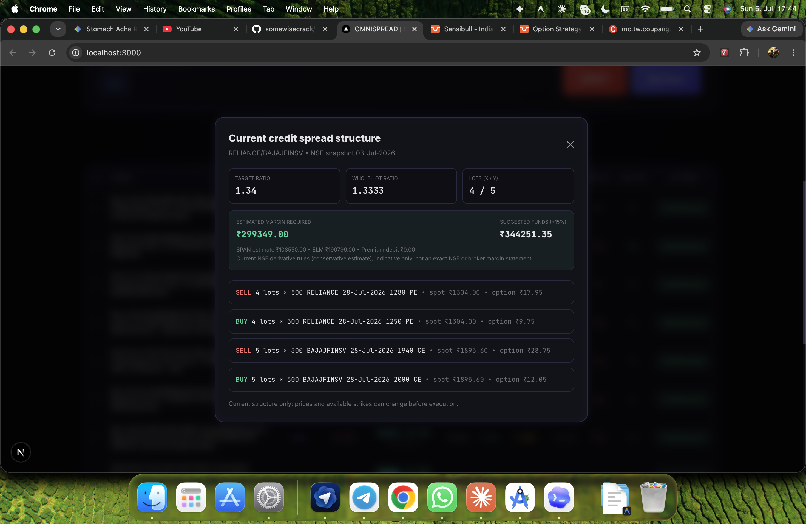

# OmniSpread

**Statistical Pairs Trading Scanner** — Kalman-filtered cointegration, Monte Carlo P(profit), and Hurst exponent analysis.



## Features

- **Dual Cointegration Tests** — CADF (Augmented Dickey-Fuller) + Johansen (trace & max eigenvalue)
- **Kalman-Filtered Beta** — Dynamic hedge ratio estimation
- **Ensemble Monte Carlo** — 80 parameter-uncertainty draws × 2,000 simulations with block bootstrap
- **Hurst Exponent** — Mean-reversion strength filter (H < 0.45)
- **Extreme Z Tracking** — Detects if current spread is at historical extreme within half-life window
- **Industry Classification** — Same-sector flagging via yfinance
- **8 Built-in Presets** — US (Mega Tech, Financials, Energy, Healthcare, Consumer, Semiconductors) + India (Nifty 50, Nifty F&O)

## Stack

| Layer | Technology |
|-------|-----------|
| Backend | Python 3.10+, FastAPI, uvicorn |
| Engine | statsmodels, yfinance, scipy, numpy, pandas |
| Frontend | Next.js 16, TypeScript, Lightweight Charts |
| Desktop | macOS .app launcher (bash) |

## Quick Start

```bash
# Backend
cd backend
pip3 install -r requirements.txt
python3 -m uvicorn main:app --host 0.0.0.0 --port 8000

# Frontend (separate terminal)
cd frontend
npm install
npm run dev -- --port 3000
```

Or use the launcher:
```bash
bash launch.sh
```

## CLI

Run the scanner straight from the terminal — no server or browser needed. It reuses the same engine as the web app.

```bash
cd backend

# List built-in ticker presets
python3 cli.py presets

# Scan a preset
python3 cli.py scan --preset mega_tech

# Scan custom tickers with options
python3 cli.py scan --tickers AAPL MSFT NVDA --period 2y --interval 1d

# Filter and limit the output
python3 cli.py scan --preset financials --min-prob 60 --limit 10

# Emit JSON (to stdout or a file) for piping into other tools
python3 cli.py scan --preset energy --json results.json
```

| Flag | Description |
|------|-------------|
| `--preset` / `--tickers` | Ticker universe (mutually exclusive, one required) |
| `--period` | Lookback, e.g. `1y`, `3y`, `60d` (default `3y`) |
| `--interval` | Bar size, e.g. `1d`, `60m`, `15m` (default `1d`) |
| `--start` / `--end` | Explicit date range (overrides `--period`) |
| `--top-n` | Max cointegrated pairs to run Monte Carlo on (default `50`) |
| `--min-prob` | Only show pairs with P(profit) ≥ this percent |
| `--limit` | Show only the first N pairs |
| `--json [FILE]` | Output JSON instead of a table (stdout if no file) |

### Backtesting a pair

Backtest a single pair across all four strategy types (stocks, futures, futures+options, credit spreads):

```bash
# All four strategies at once
python3 cli.py backtest --x ITC.NS --y DRREDDY.NS --qty 3.0 \
    --direction SHORT_SPREAD --half-life 8 --end-date 2025-06-06

# A single strategy
python3 cli.py backtest --x ITC.NS --y DRREDDY.NS --qty 3.0 \
    --half-life 8 --end-date 2025-06-06 --strategy credit_spreads
```

| Flag | Description |
|------|-------------|
| `--x` / `--y` | The two legs (e.g. `ITC.NS`, `DRREDDY.NS`) |
| `--qty` | Hedge ratio — X shares per 1 Y share |
| `--direction` | `SHORT_SPREAD` / `LONG_SPREAD` (default `SHORT_SPREAD`) |
| `--half-life` | Exit horizon in bars |
| `--end-date` | Entry date (`YYYY-MM-DD`) |
| `--strategy` | `all` (default), `equity`, `futures`, `futures_options`, or `credit_spreads` |
| `--interval` | Bar interval — equity only; derivatives are daily |
| `--json [FILE]` | Output JSON instead of a table |

> Equity P&L is per share; futures/options/credit-spread P&L is per whole-lot hedge (much larger notional). Derivatives strategies require `nselib` and NSE daily data.

## How It Works

1. **Screen** all ticker pairs for cointegration (CADF + Johansen)
2. **Filter** by |Z-score| > 2.0 and Hurst < 0.45
3. **Simulate** spread evolution with ensemble MC (parameter uncertainty + block bootstrap residuals)
4. **Report** P(profit within half-life), expected return, extreme-Z status, and trade direction

## License

For educational and research purposes only. Not financial advice.
