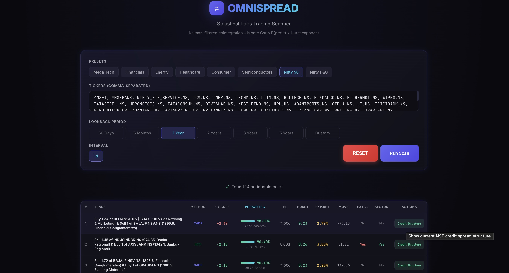

# OmniSpread

**Statistical Pairs Trading Scanner** — Kalman-filtered cointegration, Monte Carlo P(profit), and Hurst exponent analysis.



## Features

- **Dual Cointegration Tests** — CADF (Augmented Dickey-Fuller) + Johansen (trace & max eigenvalue)
- **Kalman-Filtered Beta** — Dynamic hedge ratio estimation
- **Ensemble Monte Carlo** — 80 parameter-uncertainty draws × 2,000 simulations with block bootstrap
- **Hurst Exponent** — Mean-reversion strength filter (H < 0.45)
- **Extreme Z Tracking** — Detects if current spread is at historical extreme within half-life window
- **Industry Classification** — Same-sector flagging via yfinance
- **8 Built-in Presets** — US (Mega Tech, Financials, Energy, Healthcare, Consumer, Semiconductors) + India (Nifty 50, Nifty F&O)

## Stack

| Layer | Technology |
|-------|-----------|
| Backend | Python 3.10+, FastAPI, uvicorn |
| Engine | statsmodels, yfinance, scipy, numpy, pandas |
| Frontend | Next.js 16, TypeScript, Lightweight Charts |
| Desktop | macOS .app launcher (bash) |

## Quick Start

The backend **must** run from the project virtual environment at `backend/.venv`.
A bare `python3` on `PATH` is often a different interpreter with none of the
dependencies installed, which fails at import with `No module named 'numpy'`.

```bash
# Backend — create the venv once, then always use it
cd backend
python3 -m venv .venv
.venv/bin/python -m pip install --upgrade pip
.venv/bin/python -m pip install -r requirements.txt
.venv/bin/python -m uvicorn main:app --host 0.0.0.0 --port 8000

# Frontend (separate terminal)
cd frontend
npm install
npm run dev -- --port 3000
```

Or use the launcher, which picks up `backend/.venv` automatically:
```bash
bash launch.sh
```

Verify the environment at any time:
```bash
cd backend && .venv/bin/python -c "import numpy, pandas, scipy, nselib; print('deps OK')"
```

Run the tests (never touches the network):
```bash
cd backend && .venv/bin/python -m pytest -q
```

Requirements are pinned to the versions verified on **Python 3.14.0**. Use
`.venv/bin/python` (or `.venv/bin/pip`) for every backend command — `pip3` and
`python3` may resolve elsewhere.

### NSE data availability — requires an India-presenting IP

Futures, options and credit-spread features read NSE via `nselib`. **NSE
geo-restricts its API behind Akamai.** From an address Akamai does not accept,
requests are refused with an `Access Denied` page or simply left to hang, and
these features stop working. Nothing in this repo can bypass that — it is the
single most common cause of "futures and options suddenly stopped working".

**If derivatives features fail, check the egress IP first.** A VPN with an
Indian exit restores them immediately.

Beware that geolocation databases disagree about VPN endpoints. The same address
has been observed reported as both `London, GB` (ipinfo.io) and
`Chennai, IN` (ip-api.com). Do not conclude anything from a single lookup —
what matters is whether NSE serves it:

```bash
cd backend && .venv/bin/python -c "
import nse_client
print(nse_client.fetch_future(symbol='TECHM', instrument='FUTSTK', period='1M').shape)"
```

Equity scanning and equity backtests use Yahoo Finance and are unaffected by all
of this.

#### TLS transport (secondary)

Separately, a bare `GET https://www.nseindia.com/` is answered with `403` for
plain `requests` (nselib's transport) but `200` for a Chrome TLS handshake, so
`backend/nse_client.py` routes nselib's HTTP through `curl_cffi`.

This is defence in depth, **not** the fix for the geo block: from an accepted IP,
nselib's own transport reaches the data endpoints perfectly well. To disable:

```bash
export OMNISPREAD_NSE_TRANSPORT=requests
```

`nse_client` also bounds every NSE call at 15 seconds. Without it a stalled edge
would hang the request until the frontend proxy reset the connection, surfacing
in the browser as a misleading "Internal Server Error".

## CLI

Run the scanner straight from the terminal — no server or browser needed. It reuses the same engine as the web app.

```bash
cd backend

# List built-in ticker presets
python3 cli.py presets

# Scan a preset
python3 cli.py scan --preset mega_tech

# Scan custom tickers with options
python3 cli.py scan --tickers AAPL MSFT NVDA --period 2y --interval 1d

# Filter and limit the output
python3 cli.py scan --preset financials --min-prob 60 --limit 10

# Emit JSON (to stdout or a file) for piping into other tools
python3 cli.py scan --preset energy --json results.json
```

| Flag | Description |
|------|-------------|
| `--preset` / `--tickers` | Ticker universe (mutually exclusive, one required) |
| `--period` | Lookback, e.g. `1y`, `3y`, `60d` (default `3y`) |
| `--interval` | Bar size, e.g. `1d`, `60m`, `15m` (default `1d`) |
| `--start` / `--end` | Explicit date range (overrides `--period`) |
| `--top-n` | Max cointegrated pairs to run Monte Carlo on (default `50`) |
| `--min-prob` | Only show pairs with P(profit) ≥ this percent |
| `--limit` | Show only the first N pairs |
| `--json [FILE]` | Output JSON instead of a table (stdout if no file) |

### Backtesting a pair

Backtest a single pair across all four strategy types (stocks, futures, futures+options, credit spreads):

```bash
# All four strategies at once
python3 cli.py backtest --x ITC.NS --y DRREDDY.NS --qty 3.0 \
    --direction SHORT_SPREAD --half-life 8 --end-date 2025-06-06

# A single strategy
python3 cli.py backtest --x ITC.NS --y DRREDDY.NS --qty 3.0 \
    --half-life 8 --end-date 2025-06-06 --strategy credit_spreads
```

| Flag | Description |
|------|-------------|
| `--x` / `--y` | The two legs (e.g. `ITC.NS`, `DRREDDY.NS`) |
| `--qty` | Hedge ratio — X shares per 1 Y share |
| `--direction` | `SHORT_SPREAD` / `LONG_SPREAD` (default `SHORT_SPREAD`) |
| `--half-life` | Exit horizon in bars |
| `--end-date` | Entry date (`YYYY-MM-DD`) |
| `--strategy` | `all` (default), `equity`, `futures`, `futures_options`, or `credit_spreads` |
| `--interval` | Bar interval — equity only; derivatives are daily |
| `--json [FILE]` | Output JSON instead of a table |
| `--strike-rule` | Credit-spread strikes: `legacy` (default) or `vol` |
| `--sold-sd` / `--hedge-sd` | Strike distance in expected moves (`vol` rule only) |

> Equity P&L is per share; futures/options/credit-spread P&L is per whole-lot hedge (much larger notional). Derivatives strategies require `nselib` and NSE daily data.

### Credit-spread strike selection

Two rules are available, selected with `--strike-rule` (API: `strike_rule`):

| Rule | Sold strike | Hedge strike |
|------|-------------|--------------|
| **`vol` (default)** | `--sold-sd` expected moves OTM (default 1.0) | `--hedge-sd` expected moves OTM (default 1.75) |
| `legacy` | flat 2% OTM | three *listed strikes* further OTM |

The `vol` rule sizes strikes by the **expected move implied by the ATM straddle**. Since an ATM
straddle is worth about `S·σ·√T·√(2/π)`, the one-standard-deviation move is `straddle × 1.2533` —
so no volatility, tenor or rate input is required; the traded option prices already embed them.

Why it exists: a flat 2% offset ignores volatility and time. On a two-month option at ~27% vol it
lands only ~0.16 SD out (a ~57% chance of finishing ITM), and the legacy hedge width depends on
whatever strike spacing the exchange happens to list — the same rule can produce 3x different max
loss on the same name. The `vol` rule makes both the distance and the wing width scale with
volatility and tenor, so risk is intentional and comparable across pairs and dates.

NSE publishes a settlement price for strikes that never traded, which can badly inflate the
straddle. When only one side of the ATM pair has traded volume, the other is rebuilt from
put-call parity rather than trusted.

If a chain is too shallow to express the volatility-scaled strikes — one standard
deviation can land at or beyond the outermost listed strike — the leg falls back
to the legacy offset and logs a warning rather than failing the structure.

```bash
# vol is the default; pass --strike-rule legacy for the old fixed-offset rule
python3 cli.py backtest --x INFY.NS --y TECHM.NS --qty 1.31 \
    --half-life 11 --end-date 2026-07-01 --strategy credit_spreads --strike-rule legacy
```

Worked example (HCLTECH/BAJFINANCE, entry 2026-07-01, spots 1034.20 / 1014.90):

| | `vol` | `legacy` |
|---|---|---|
| HCLTECH PE | sold 930 / hedge 900 | sold 1010 / hedge 980 |
| BAJFINANCE CE | sold 1090 / hedge 1140 | sold 1040 / hedge 1070 |
| Credit | ₹13,110 | ₹29,175 |
| Margin | ₹194,609 | ₹148,544 |

Note the legacy wings are both exactly 30 points — three listed strikes — while
the `vol` wings differ per name (30 and 50) because they scale with each stock's
own expected move.

## How It Works

1. **Screen** all ticker pairs for cointegration (CADF + Johansen)
2. **Filter** by |Z-score| > 2.0 and Hurst < 0.45
3. **Simulate** spread evolution with ensemble MC (parameter uncertainty + block bootstrap residuals)
4. **Report** P(profit within half-life), expected return, extreme-Z status, and trade direction

## License

For educational and research purposes only. Not financial advice.
